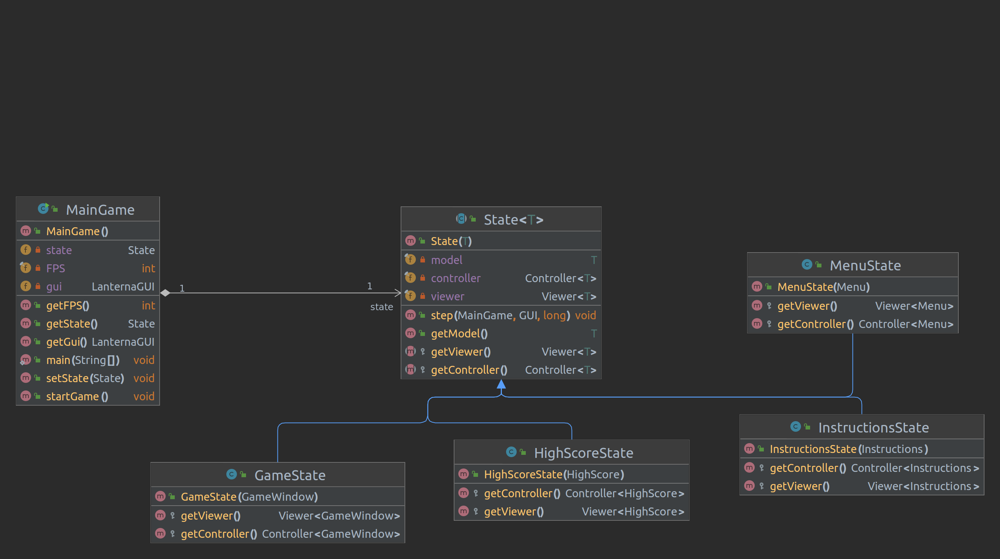
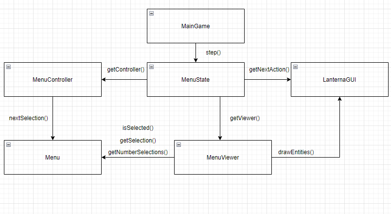
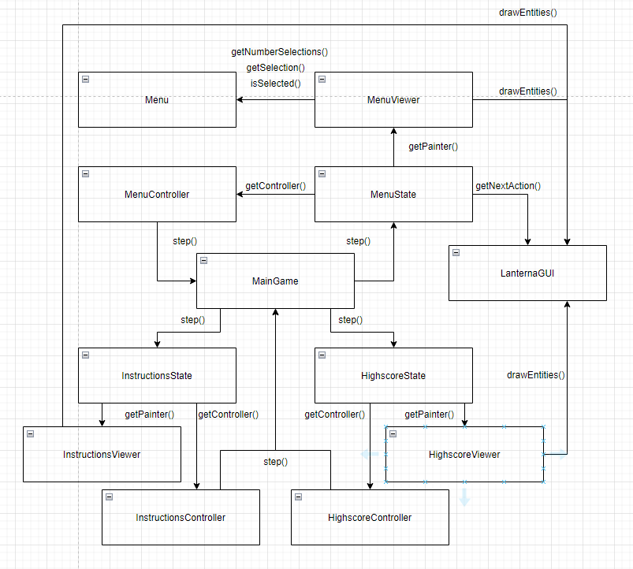
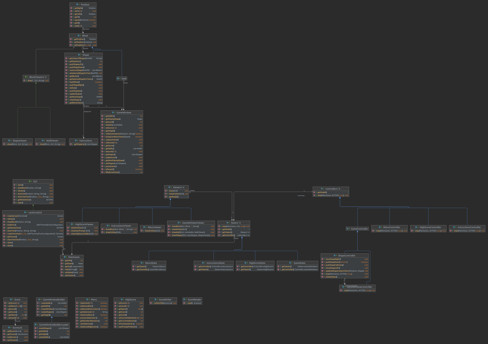
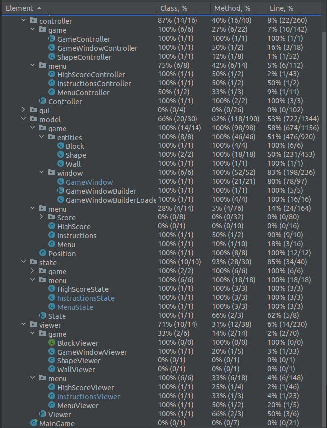

## LDTS_1608 - Pentis

Following up on one of the most successful video games in all history, Pentis surges forward to claim its own spot 
along its small brother Tetris as one of the greatest of all time.
With all new desgin and shape, a challenge is guaranteed to be presented before you.

But there's more. Besides hold more than twice the amount of shape presented than in Tetris, the big brother also
gives you the opportunity to call onto Miss Luck and switch the playing shape once everytime a new round starts.
 
This project was developed by *Pedro Fonseca* (*up202108653*@fe.up.pt) and *Jorge Restivo* (*up202108886*@fe.up.pt)
for LDTS 2022/23.

### IMPLEMENTED FEATURES

- **Main Menu** - The player has an interface where they can choose to either
start a new game, enter the HighScore Menu or to exit the game.
- **Automatic Start** - As soon as the player hops into a new game, a shape is already drawn onto the screen, ready to
be controlled.
- **Window borders** - Implemented a "wall" for the game gameWindow which will serve as a collision detector so that
  the shape the player is controlling doesn't go out of bounds.
- **Collision Detector** - This allows the game to not let the shape go out of bounds or make it stop once it reaches
  the floor.
- **Next Shapes** - A visual hint letting the player know what the next 2 playable shapes will look like.
- **Shape Rotation** - By pressing the Arrow-Up key, the shape rotates 90º clockwise.
- **Points Mechanic** - The player is awarded points every time they clear a line or push down a Shape,
  increasing in value the longer the player has survived.
- **Level counter** - After a player is awarded a certain amount of points, their in-game level is increased, along
  with the game's difficulty.
- **Difficulty Increase** - When a player rises in level, so will the difficulty of the game, meaning the shapes takes
  less time to fall, leaving the player with less time to think.
- **Shape-Shifting** - The player has the chance to switch the shape they're controlling once every round.
- **HighScore Mechanic** - A tab in the Main Menu where you can see the highest scorer.
- **File To Save HighScore** - A file that saves the current highscores.

### THE GAME CONTROLLER AND VIEWER SHOULD BE DIFFERENT DEPENDING ON THE CURRENT GAMESTATE
-**Problem in context**

Seeing as this is a game with several sections, for example, a Menu or the Game instance, there was a problem with implementing
the variance of the several functionalities within different sections. The controller was being shared by both the Menu 
and the Game instance, as well as the Viewer. Also, because a Menu and the Game itself are different sections, flags were
needed everywhere to check weather such functionality was supposed to be available to a certain section.
Clearly violating the **Single Responsibility Principle** we had to think of a way to implement every feature without 
this violation and the use of the **State** pattern allows for this.

-**State Pattern**

After applying this pattern to the game, we were able to differentiate several controller and viewers, initialized each
by their respective **State**, allowing us to stop the aforementioned violation since now only one controller or viewer 
is being utilized by a Menu or the Game Instance. There's no more "global" controller or viewer.

With the implemented pattern, this is how these patterns interact with the **MainGame** Class:

An example of the interaction of the **MenuState** with its controller and viewer:

The classes involving such pattern are in the following files:
- [MainGame](../src/main/java/org/example/MainGame.java)
- [MenuState](../src/main/java/org/example/state/menu/MenuState.java)
- [HighScoreState](../src/main/java/org/example/state/menu/HighScoreState.java)
- [InstructionsState](../src/main/java/org/example/state/menu/InstructionsState.java)
- [GameState](../src/main/java/org/example/state/game/GameState.java)

-**Consequences**

-Several states now define their own controllers and viewers before anything else.

-No more the need for several flags within the controller and viewer.

-A significant increase in the number of classes but still manageable nonetheless.

### DESIGN

This is how the many States interact with each controller and viewer, and how they connect back to the **MainGame**:

And this is the full UML implementation:

### SEVERAL CONDITIONAL STATMENTS IN EACH CONTROLLER
In each controller, there are several conditional statements checking which action was performed by the user.
This list of conditionals could potentially rise to a huge numbers if such different actions were possible within game.

A way to resolve this issue would be to implement the **Command Pattern** to resolve this issue of many conditionals,
all testing for the same thing.

### TESTING

-Coverage report

-Mutation Report
For some reason, we were unable to get Pitest to work.
Therefore, we could not get a Mutation Report

### SELF-EVALUATION

- Pedro Fonseca: 50%
- Jorge Restivo: 50%